# Ultraresearch Synthesis: Cross-Agent LLM Execution Harness Architecture 2026

Workers: orchestrator-owned research, no subagents due active tool policy · Waves: 1 source sweep plus lead closure · Sources: 26 primary/current sources · Verifications: source-level only

## Executive Summary

The 2026 architecture pattern is not one protocol or one framework. A Cross-Agent LLM Execution Harness should be a portable Skill package with a deterministic CLI/state machine at the center, a browser event surface for creator interaction, a task/artifact port for remote agents, a tool/data port for MCP or direct APIs, and a durable event ledger that survives host-agent changes.

The clean boundary is: Agent Skills package the harness for Codex/Claude/OpenClaw-like hosts; AG-UI-like events connect localhost creator intake and result review; A2A is the optional remote-agent collaboration protocol; MCP is the optional tool/data protocol; Temporal/LangGraph-style durability informs the state machine; OpenTelemetry/W3C tracing and OWASP/NSA security guidance define the evidence and trust envelope.

For this project, the recommended reference architecture is a hybrid local control plane: Skill + CLI + JSON manifests as the stable core, a domain-pack interface for workload-specific resolver/planner/validator/adapter/review/finalizer logic, local AG-UI-style browser surfaces for human interrupts, optional MCP adapters only behind explicit capability discovery, and optional A2A adapters only for external agent services. Image generation is reference domain pack 1, using direct Comfy Cloud/Civitai adapters, `initial_brief`, `targeted_followup`, and `review_gallery` as the image-specific human surfaces. Under Q19, that image pack ships built in for first-version usability, but a hard `domain_pack_manifest.json` boundary prevents harness core from importing or special-casing Civitai/Comfy/image logic outside the generic domain-pack interface. Under Q20, future non-image domain packs use a manifest-first allowlist: built-in packs are bundled explicitly, while future packs must be installed/registered, schema-validated, versioned, security-inventoried, allowlisted, and enabled by workspace/user config before core can load them. Under Q21, registered packs still receive only least-privilege capability grants: human-readable permission groups are shown during install/register and workspace enablement, granted/effective scopes are stored in registry/config, workspace settings can narrow user grants, and undeclared capabilities are denied by default. Under Q22, external pack executable code runs out-of-process through JSON IPC/CLI workers; built-in packs may be bundled but must satisfy the same worker interface, and core projects only effective granted env vars, file roots, provider refs, budget scopes, and memory scopes into each worker invocation. Under Q23, those workers still do not perform side effects directly: they emit typed side-effect requests and core capability brokers perform provider calls, network access, file writes, budget spend, project memory writes, and external tool/agent calls after enforcing effective scope, budget, credential refs, traces, output inspection, and evidence. After each rendered domain output batch, the review loop must pause: LLM proposal cards are advisory, and no rerun/refine/branch/accept continuation may occur until a human action is saved. When the saved action is accept, the system writes a full domain reproducibility package, not only final output files. Project memory is separate from acceptance: only selected reuse dimensions get saved as managed references to final packages, and later workspaces apply them only when the human selects visible memory cards in the initial brief. Cross-agent continuation uses a clean handoff manifest with status, selected artifacts, chosen memory refs, and trace/evidence pointers, not chat transcript, raw secrets, or hidden browser state; that handoff is refreshed only at stable checkpoints rather than every internal state write. Under Q18, a resumed agent must first show a "continue this work?" confirmation screen with current status, next action, remaining budget, selected memory refs, and blockers, and cannot spend budget or submit a new job until confirmation is saved. The product should not become an MCP server or an image-generation app.

Q24 locks broker lifecycle safety: every brokered side-effect request requires an `idempotency_key`, explicit `retry_policy`, `timeout`, `cancel_token`, lifecycle events, and terminal outcome. Core brokers deduplicate repeated idempotency keys, record retry/cancel/timeout outcomes, and never blindly retry non-idempotent provider calls, file writes, memory writes, budget spends, or external tool/agent calls.

Q25 locks long-running provider-job ownership: after broker approval, provider job refs, resume handles, leases, polling cadence, cancel tokens, provider status, and terminal outcomes are core scheduler state in `job_manifest.json`, `event_log.jsonl`, and `side_effect_result.json`. Workers stay stateless and re-enter through manifests rather than owning hidden polling loops.

Q26 locks scheduler concurrency: workspace/job mutation uses a single-writer lease with heartbeat and TTL. Only the active lease holder may submit, poll, cancel, continue, or finalize; stale leases recover after TTL with event-log evidence, and non-holder agents receive read-only status/resume surfaces until they acquire the lease.

Q27 locks the first durable state substrate: file-first workspace state is source of truth, using append-only JSONL event logs, JSON manifests, atomic writes, file locks, and checksums. SQLite, Temporal, or hosted stores may become adapters later only if they export the same canonical manifests and event history.

Q28 locks state evolution: append-only event logs remain the audit source, while periodic `snapshot_manifest.json` files speed resume and carry `schema_version`, covered event ranges, checksum chains, and migration-ledger references. Compaction is retention-gated and cannot silently delete original events before final package or handoff retention rules allow it.

Q29 locks localhost UI session security: intake, review, and resume servers bind loopback-only by default, create one-time session-token URLs with short TTLs, require CSRF tokens plus origin checks for mutating actions, keep static artifacts read-only unless an action-scoped token grants mutation, and still route saved actions through CLI/state lease checks.

Q30 locks local actor identity and trust: each host agent uses a stable local `agent_id` plus fresh `agent_session_id`, human-visible label, runtime metadata, optional signing key/fingerprint, and workspace trust status. Unknown agents may inspect read-only handoff/status surfaces, but lease acquisition, budget-spending mutation, project-memory writes, resume confirmation, handoff mutation, and finalization require explicit workspace trust grants recorded in `agent_trust_registry.json`. Events, leases, broker requests/results, UI confirmations, and handoff/resume records carry actor identity plus trust state.

Q31 locks retention and cleanup: workspace artifacts receive retention classes. Final packages and opt-in project memory persist until explicit deletion; handoff/status packages persist until superseded or finalized; event logs and snapshots persist until final-package/handoff retention rules permit compaction; raw intermediates, temp renders, and provider caches are pruned only after reproducibility and handoff proofs exist; every deletion writes a tombstone event, and raw secrets are never retained as cleanup evidence.

Q32 locks LLM decision execution: host agents write typed `decision_manifest.json` and `proposal_manifest.json` records, while the harness core remains deterministic and consumes only validated manifests. Any harness-owned model call is an optional brokered side effect through an LLM provider adapter and must record provider profile, budget, input hash, model id, output schema, credential ref, trace, actor/trust, and `llm_call_manifest.json` evidence. The core must not hide an internal LLM router or accept free-form prose as authority.

Q33 locks live-provider-first execution and QA: when provider credentials resolve and budget, actor trust, lease, idempotency, broker, and cleanup gates pass, the first implementation and executable demos use the real provider path by default. Mock, fixture, or offline execution remains available for missing credentials, explicit offline mode, deterministic unit tests, and failure fixtures, but each non-live path records a fallback reason.

Q34 locks provider-profile live spend hard caps: every credential profile used for live execution declares `max_live_smoke_spend`, `max_live_jobs`, max wall-clock, and cleanup requirements. Live execution blocks when the cap is missing or lower than the workspace budget envelope, and cap changes require explicit provider-profile update evidence rather than silent escalation from agent proposals, creator intake, or workspace config.

Q35 locks CI/live-provider separation: default CI and PR checks stay mock/offline even when credentials and provider-profile caps exist. Live provider checks run only as explicit manual, scheduled, label-gated, or env-gated jobs with cap evidence, cleanup evidence, timeout, terminal provider status, and fallback/block reasons; local executable demos stay live-first.

Q36 locks the non-image proof level: v1 includes a real second non-image production domain pack, not only a fixture or static boundary test. The exact domain is selected in Q37, but it must exercise the same Skill/CLI/state/review/finalize/handoff lifecycle with domain-native artifacts and without Civitai, Comfy, image files, graph-patch taxonomy, or visual-gallery assumptions.

## Architecture Reference Model

```mermaid
flowchart LR
  Human["Human browser"] -->|AG-UI-like events over localhost| UI["Intake and review server"]
  Host["Codex / Claude Code / OpenClaw host"] -->|Agent Skill loads instructions| Skill["Skill package"]
  Host --> Actor["Agent identity and trust registry"]
  Host --> Decision["Decision and proposal manifests"]
  Skill --> CLI["Deterministic harness CLI"]
  Actor --> CLI
  Decision --> CLI
  CLI --> Registry["Domain pack registry and allowlist"]
  Registry --> Perms["Capability grant gate"]
  Perms --> Worker["Domain pack worker boundary"]
  Worker --> Domain["Domain pack interface"]
  Worker --> Broker["Core capability brokers"]
  UI --> State["Workspace event log and manifests"]
  CLI --> State
  Actor --> State
  Domain --> Planner["Domain planner / patch compiler"]
  Planner --> Resolver["Domain link, workflow, asset, capability resolver"]
  Resolver --> Patch["Typed domain patch engine"]
  Patch --> Validate["Original and patched artifact validator"]
  Validate --> Gates["Credential, budget, rights, policy gates"]
  Gates --> Exec["Execution scheduler"]
  Broker --> Exec
  Broker --> LLM["Optional brokered LLM provider adapter"]
  Exec --> Direct["Comfy Cloud / Civitai direct adapters"]
  Exec --> MCP["Optional MCP tool/data adapters"]
  Exec --> A2A["Optional A2A remote-agent adapters"]
  Direct --> Outputs["Domain outputs, sidecars, manifests"]
  MCP --> Outputs
  A2A --> Outputs
  Outputs --> Review["localhost review surface + static artifacts"]
  Review -->|saved human action| Feedback["feedback.json + loop_state.json"]
  Feedback -->|accept| FinalPkg["final_package_manifest.json + reproducibility package"]
  FinalPkg -->|opt-in reuse| Memory["project_memory_manifest.json"]
  FinalPkg --> Retention["Retention policy and cleanup plan"]
  Memory -->|selected in next initial_brief| UI
  Memory --> Retention
  Feedback --> Planner
  State --> Obs["Trace/evidence ledger"]
  State --> Retention
  Retention --> State
  Exec --> Obs
  LLM --> Obs
  Gates --> Obs
  State --> Handoff["handoff_manifest.json"]
  Handoff --> Host
```



## Units By Responsibility

| Unit | Responsibility | Inputs | Outputs | External connection |
| --- | --- | --- | --- | --- |
| Skill package | Portable host entrypoint with `SKILL.md`, references, and scripts. | Host prompt, project files. | Loaded instructions, CLI invocation contract. | Agent Skills / Codex Skills. |
| CLI command router | Deterministic command surface shared by all agents. | JSON/file arguments. | JSON results, concise stdout, exit codes. | Local process. |
| Workspace state store | File-first durable manifests, append-only event log, locks, atomic writes, checksums, snapshots, and schema migration ledger. | All command events and manifest updates. | `workspace.json`, `loop_state.json`, `event_log.jsonl`, `snapshot_manifest.json`, `migration_ledger.json`, lock records, checksum chain, evidence. | Filesystem source of truth; snapshots optimize replay, and SQLite/Temporal adapters only if manifest-export compatible. |
| Actor identity/trust registry | Gives every host agent a local identity and gates mutations by workspace trust state. | `agent_identity.json`, `agent_trust_registry.json`, host/runtime metadata, optional key fingerprint, trust grant/revoke events. | Stable `agent_id`, current `agent_session_id`, trust state, granted operations, read-only denial records, actor evidence on events/leases/broker/UI/handoff records. | Filesystem trust registry and optional local signing key. |
| Retention and cleanup manager | Classifies artifacts, exposes creator-visible cleanup, prunes only proof-eligible intermediates, and records deletion tombstones. | `retention_policy.json`, `cleanup_plan.json`, artifact manifests, final-package/handoff proofs, actor trust state. | retention class decisions, tombstone events, pruned intermediate/cache paths, blocked cleanup reports. | Filesystem artifact store and localhost cleanup surface. |
| Domain pack interface | Declares workload-specific resolver, planner/patcher, validator, adapter, review renderer, finalizer, memory dimensions, and QA fixtures behind the shared harness lifecycle. | Domain pack manifest, workspace objective, artifacts. | Domain-specific manifests and schema extensions; `core_import_allowed=false` for domain internals. | Filesystem package/module boundary. |
| Second production domain pack | Proves the harness lifecycle outside image generation with a real non-image workload selected in Q37. | Generic lifecycle commands, Q37 domain inputs, capability grants, worker/broker envelopes. | Domain-native artifacts, review session, saved action, final package, handoff, second-domain QA evidence. | Domain-specific adapter and localhost review surface behind the same pack contract. |
| Domain pack registry / allowlist | Records built-in and future pack registration state before the core may load a pack. | `domain_pack_manifest.json`, install/register request, schema validation result, security inventory, workspace/user config. | `domain_pack_registry.json`, allowlist/enablement status, version/source metadata, load/no-load decision. | Filesystem config and security inventory. |
| Capability grant gate | Enforces least-privilege capabilities for registered packs before resolver/planner/adapter code can act. | Declared capability groups, user grants, workspace narrowing, current action request. | Granted/effective scopes, denied capability events, permission follow-up payloads. | Local config and policy engine. |
| Domain pack worker boundary | Runs external pack executable code out-of-process through JSON IPC/CLI workers and applies scoped projection. | Registered pack id, worker manifest, effective scopes, JSON request. | JSON response, worker logs, exit status, trace/evidence records. | Local child process / IPC. |
| Core capability brokers | Perform all side effects requested by workers after enforcing policy. | `side_effect_request.json`, effective scopes, credential refs, budget envelope, output-inspection policy, idempotency key, retry policy, timeout, cancel token. | `side_effect_result.json`, approved/denied/cancelled/timed_out/retry_exhausted events, retry attempts, output hashes, budget consumed, evidence path, terminal reason. | Direct providers, filesystem, memory store, MCP/A2A/tool ports. |
| LLM decision boundary | Keeps LLM-authored decisions outside deterministic core unless represented as typed, validated manifests. | Host agent outputs, `decision_manifest.json`, `proposal_manifest.json`, optional brokered `llm_model_call` request. | validated decision/proposal records, advisory proposals, `llm_call_manifest.json`, rejected free-form-prose or hidden-router evidence. | Host LLMs by default; optional brokered LLM provider adapter only as a side effect. |
| Human UI server | Loopback-only browser survey, review, and resume surface with one-time sessions and mutation guards. | Intake/review/resume session JSON, one-time token URL, CSRF token, origin. | `ui_session.json`, `creator_intake.json`, `questionnaire_session.json`, `review_gallery_session.json`, `feedback.json`, `resume_confirmation.json`. | AG-UI-like HTTP/SSE events over loopback. |
| Intent router | Converts human vocabulary into executable roles and domain planning hints. | Brief, references, domain evidence. | Intent role, ambiguity gates, patch-family hints. | Internal/domain pack. |
| Resolver | Normalizes domain assets, workflow metadata, and capabilities; image pack handles Civitai/HF/Comfy assets. | URLs/files/workflows. | `asset_manifest.json`, `workflow_import.json`, capability snapshot. | Direct APIs, optional MCP. |
| Graph patch compiler | Converts intent into typed domain patch operations; image pack emits graph patch operations. | Imported workflow, capabilities, human intent. | `graph_patch_manifest.json`. | Internal/domain pack. |
| Validation engine | Proves original and patched domain artifacts are executable before spend. | Workflow JSON or domain artifacts, capability data. | pass/fail/blocked validation records. | Provider API or mocked adapter. |
| Gate engine | Enforces budget, credential, rights, safety, unsupported capability, and ambiguity stops. | Estimates, credential refs, policy inputs. | proceed, targeted follow-up, or blocked report. | Local credential profile, browser UI. |
| Execution scheduler | Runs validated jobs and records lifecycle. | Prepared job manifest, pending provider job refs, active workspace/job lease. | `job_manifest.json`, provider resume handles, lease owner, heartbeat, TTL, polling cadence, cancel token, status events, terminal outcomes, outputs. | Direct provider API, MCP, or A2A. |
| Live provider run policy | Selects live, mock, or offline execution mode without silent fallback. | Credential profile availability, provider-profile live cap, workspace budget, actor trust, lease state, check mode, live-check gate source, explicit offline/mock flags, failure-fixture marker. | live `run_mode`, cap snapshot, cap check result, mock/offline fallback reason, provider spend evidence, cleanup proof, blocked live-provider report, gated live-check evidence. | Direct provider adapters and mocked fixture adapters. |
| Review/evaluation loop | Displays outputs, advisory proposal cards, feedback, and next-patch candidates while enforcing the Q12 human-action gate. | Result manifest, sidecars, human intent. | proposal decisions, saved human action, next plan. | Local browser. |
| Final package builder | Freezes accepted deliverables into a reusable/auditable package. | Saved accept action, result manifest, review session, workflows or domain artifacts, patch manifest, settings or equivalent inputs, cost, rights notes. | `final_package_manifest.json`, accepted domain assets, static review snapshot, workflow bundle when applicable, provenance, checksums. | Filesystem artifact store. |
| Project memory manager | Stores only human-approved reuse profiles as managed references and exposes eligible profiles as selectable cards in future initial briefs. | Memory opt-in selections, final package manifest, rights policy, current workspace initial-brief selection. | `project_memory_manifest.json`, reusable domain profile refs, disabled/deleted state, selected memory profile ids in intake state. | Filesystem artifact store. |
| Handoff package builder | Produces clean continuation package for another agent or future session at stable checkpoints. | Workspace status, allowed next actions, manifest paths/hashes, selected artifacts, memory refs, trace/evidence pointers, checkpoint reason, resume summary fields. | `handoff_manifest.json`, `resume_confirmation.json`, redaction/exclusion report, previous/current handoff hash. | Filesystem artifact store, optional A2A artifact. |
| Observability/evidence | Correlates every agent/tool/backend step. | Runtime events. | trace IDs, spans, logs, hashes, screenshots, evidence paths. | OpenTelemetry/W3C-compatible fields. |
| Security inventory | Tracks adapters, domain packs, workers, brokers, declared/granted/effective scopes, credentials, versions, risks, and approvals. | Adapter registry, domain-pack registry, worker manifest, broker manifest, capability grants, credentials metadata. | inventory, vulnerability/watch records, secret-scan results, denied capability events, worker validation records, broker approval records. | MCP/A2A/direct API/domain-pack/worker/broker metadata. |

## Functional Architecture

### 1. Package and host compatibility

Use Agent Skills as the outer packaging standard. OpenAI Codex Skills and the Agent Skills standard both describe a skill as a folder with a `SKILL.md` manifest, instructions, resources, and optional scripts. The harness should therefore keep host-specific natural-language instructions thin and put repeatable behavior in scripts/CLI commands.

### 2. Agent orchestration

OpenAI Agents SDK, Google ADK, Pydantic AI, LangGraph, CrewAI, and LlamaIndex converge on the same primitives: agent units, tools, handoffs/delegation, events, state, workflows, and human gates. The harness should expose those as explicit state transitions instead of relying on a host chat transcript.

Recommended internal shape:

```text
intent_received -> intake_checked -> references_resolved -> workflow_imported
-> original_validated -> patch_planned -> patch_validated
-> credential_checked -> budget_checked -> submitted -> running
-> outputs_rendered -> review_open -> proposals_rendered -> creator_action_required -> feedback_saved
-> accepted | continued | blocked | stopped
accepted -> final_package_created -> optional_project_memory_saved
future workspace: initial_brief_open -> memory_cards_shown -> selected_memory_applied | no_memory_selected
handoff: initial_brief_submitted|review_ready|feedback_action_saved|final_package_created -> clean_handoff_manifest_created -> resume_confirmation_required -> resume_confirmed -> resumed_by_agent | exported_to_creator
```

### 3. Agent-to-user connection

AG-UI is the best current reference for the human-facing interrupt surface because it standardizes bidirectional, event-based communication between frontends and agent backends. In the image domain pack this surface uses creator-facing language. The implementation does not need to claim full AG-UI compliance on day one, but it should mirror the event model:

- lifecycle events for run start, validation, execution, rendering, blocked, stopped;
- state events for intake answers, budget, selected reference role, selected memory cards, selected result;
- tool/activity events for long-running Comfy/Civitai jobs;
- custom proposal events for ranked next actions.
- human action events for accept, rerun, refine, branch, or stop. Proposal events alone are not authorization to spend or continue after results render.

This aligns with the already locked `localhost questionnaire` and `localhost review gallery` decisions, but keeps them as image-pack implementations of a generic human-interrupt contract.

### 4. Agent-to-agent connection

A2A is the external agent port. It is useful when a remote independent agent service needs task status, artifacts, streaming, push notifications, or extension negotiation. It should not replace the local Skill+CLI core. Model A2A output as:

```json
{
  "agent_card_ref": "...",
  "task_id": "...",
  "context_id": "...",
  "status": "working|input-required|completed|failed",
  "artifacts": ["result_manifest.json", "review/index.html"],
  "trace_id": "..."
}
```

For the image harness, A2A is initially optional. Add it as an adapter only after the direct local workflow is stable.

When A2A is used, expose `handoff_manifest.json` and selected artifact refs as the task artifact, not the full workspace directory or chat transcript.

### 5. Agent-to-tool/data connection

MCP is the tool/data port, not the core product. Use MCP only where it provides useful dynamic tool/resource discovery or a third-party tool surface. Keep direct first-party adapters for Comfy Cloud and Civitai when their APIs are the source of truth. The MCP boundary must include:

- transport metadata: `stdio` or `streamable_http`;
- server identity and version;
- capability snapshot;
- OAuth/resource metadata if remote;
- scopes and least-privilege policy;
- tool output inspection before downstream graph patches consume the result.

### 6. Durable execution

Temporal and LangGraph show the current split: deterministic orchestration state, nondeterministic LLM/tool/API work as recorded activities, and resumable human-in-loop waits. The first implementation can be filesystem-backed, but its state model should be compatible with a future durable executor:

- every external call gets an idempotency key;
- every LLM decision is host-agent-first by default and records input hash, host agent id/session, output schema version, selected action, and validation evidence in `decision_manifest.json` or `proposal_manifest.json`; optional harness-owned model calls are brokered side effects with model/provider, budget, credential ref, output schema, trace, and `llm_call_manifest.json`;
- every expensive job has a resumable state and a terminal reason;
- human review can pause without losing `loop_state.json`.
- post-result continuation requires a saved creator action; low evaluator confidence may create proposal cards but must not submit a new job by itself.
- mutating resume, lease, broker, budget, memory, handoff, and finalization commands require a trusted actor identity, not only a process name or chat transcript.
- credentialed provider execution defaults to live `run_mode`; mock/offline execution is explicit or evidence-backed and never silently substitutes for provider proof.

### 7. State and memory model

Follow the ADK distinction between Session, State, and Memory:

- Session: the current workspace run and chronological events.
- State: active budget envelope, credential refs, workflow status, selected image IDs, gates.
- Memory: reusable creator preferences and project-level constraints only after explicit creator opt-in, stored as managed references to final packages with rights/reuse scope, and applied to a new workspace only when the creator selects the eligible memory card in that workspace's initial brief.
- Artifact store: immutable outputs, static review files, final reproducibility packages, project memory manifests, clean handoff manifests, and checksums, not conversation memory.

### 8. Observability and evidence

OpenAI Agents SDK tracing and OpenTelemetry GenAI conventions establish the evidence shape: model calls, tool calls, handoffs, guardrails, custom events, MCP/provider spans, metrics, and events. W3C Trace Context gives a vendor-neutral propagation format.

Every harness run should record:

- `trace_id`, `run_id`, `workspace_id`, `task_id`, `job_id`;
- `agent_id`, `agent_session_id`, actor label, runtime/version, trust state, granted operation, and trust evidence ref for every mutating event;
- parent-child edges for planner, resolver, validator, gate, backend, renderer, reviewer;
- model/provider/tool names without secrets;
- token, latency, budget, and cost estimates;
- artifact hashes for workflow JSON, graph patches, generated images, static HTML, feedback, final package manifests, and project memory manifests;
- handoff hashes and exclusion checks for chat transcript, raw secrets, `.env`, Authorization headers, hidden browser state, browser storage, and unsaved browser-only selections;
- checkpoint reason for each handoff refresh: `initial_brief_submitted`, `review_ready`, `feedback_action_saved`, or `final_package_created`;
- resume confirmation evidence: status summary, allowed/recommended next action, budget remaining, selected memory refs, blockers, confirmation timestamp, and confirmer;
- screenshots or browser assertions for intake and review surfaces.

### 9. Security and governance

OWASP Agentic Applications Top 10 2026 and NSA MCP guidance both point to the same rule: agent security is a lifecycle design problem, not an endpoint patch. The harness needs a dedicated security module with:

- least privilege per provider/tool;
- explicit local actor identity/trust grants for cross-agent mutation authority;
- provider-specific credential refs only;
- no token passthrough into artifacts;
- SSRF and local-server safeguards for MCP/A2A/webhook routes;
- tool output inspection before the next LLM/tool consumes it;
- inventory of adapters, MCP servers, versions, scopes, and known risks;
- vulnerability watch and secret scans;
- human gates for rights, cost, credentials, unsafe requests, and unsupported capabilities.

## Module Connection Contracts

| Connection | Protocol or mechanism | Payload | Auth/secret rule | Retry/resume | Evidence |
| --- | --- | --- | --- | --- | --- |
| Host agent -> Skill | Agent Skills folder + `SKILL.md` | Natural-language instructions, scripts, refs | no secrets | host reloads skill | installed skill path/version |
| Host agent -> decision manifests | Filesystem manifests validated by CLI | `decision_manifest.json`, `proposal_manifest.json`, input refs/hashes, selected action, advisory alternatives, rationale summary, host agent id/session, actor/trust state | no free-form prose authority; no raw secrets | manifest validation and evidence replay | decision/proposal manifest hash and validation evidence |
| Skill -> CLI | local process | JSON/file args | env/profile only | command idempotency | stdout JSON, exit code |
| CLI -> actor trust registry | filesystem manifests | `agent_identity.json`, `agent_trust_registry.json`, grant/revoke events, actor session metadata | no raw keys; optional public key/fingerprint only | stable identity plus fresh session id | actor/trust evidence on events, leases, broker requests, UI confirmations |
| CLI -> state store | filesystem writes | manifests and event log | no raw keys | append-only | file hashes |
| Browser -> creator UI | loopback-only HTTP/SSE, AG-UI-like events | intake/review/resume events, one-time token URL, CSRF token | no LAN bind by default; raw tokens not persisted; mutating actions require token/CSRF/origin and CLI/lease revalidation | session JSON reload; token TTL | `ui_session.json`, Playwright screenshots/assertions |
| CLI -> MCP server | JSON-RPC over stdio or Streamable HTTP | tools/resources/prompts calls | OAuth/scopes or local allowlist | session id/cancellation | MCP span, tool output hash |
| CLI -> A2A remote agent | JSON-RPC task/message/artifact APIs, SSE/push | task, message, artifact parts | HTTPS plus webhook auth | get task/resubscribe/push | task id, artifact ids |
| CLI -> Comfy/Civitai | direct official APIs or Skill handoff | workflow/job/assets | provider credential refs | job polling/resume | job manifest, output hashes |
| Scheduler -> live provider run policy | local policy decision | credential profile, provider-profile cap, budget envelope, actor trust, lease, idempotency, check mode, live-check gate source, explicit offline/mock marker | no raw secrets; live spend only through brokered provider call, only inside provider-profile cap, and never from default CI/PR mode | live default for local executable demos when gates pass; default CI mock/offline; gated live checks require gate source | `run_mode`, `check_mode`, `live_check_gate_source`, `cap_snapshot`, `cap_check_result`, fallback reason, spend evidence, cleanup proof |
| Broker -> LLM provider | brokered `llm_model_call` side effect | provider profile, model id, input hash, output schema, budget, credential ref, trace/idempotency, actor/trust | credential refs only; prompt/output hashes and policy-redacted evidence | idempotency key plus terminal outcome | `llm_call_manifest.json`, broker result, trace span |
| Scheduler -> observability | OTel-compatible spans/events | trace/span attributes | redact content by policy | traceparent propagation | trace export/log files |
| Renderer -> review gallery | static HTML plus local server | images, sidecars, advisory proposal cards, saved creator action | no secrets | reload from manifest | `review_gallery_session.json` |
| Finalizer -> artifact store | filesystem package write | accepted images, static review page, workflows, graph patch diff, prompts/settings, provenance, cost/budget summary, rights/license notes, checksums | no secrets | idempotent package id | `final_package_manifest.json` |
| Finalizer -> project memory | managed filesystem state | opt-in style/brand/workflow reuse refs, final package id/hash, rights policy, deletion status | no secrets or raw localStorage | idempotent profile id | `project_memory_manifest.json` |
| Project memory -> creator intake | localhost UI/state store | eligible memory card summaries, selected `memory_profile_id` values, selected reuse dimensions, rights/scope status | no hidden auto-apply; no disabled/deleted/out-of-scope profiles | reloadable initial brief | `creator_intake.json`, `questionnaire_session.json` |
| Workspace -> handoff package | filesystem package write, optional A2A artifact | current status, allowed next actions, manifest paths/hashes, selected review/final artifacts, selected memory refs, trace/evidence pointers, checkpoint reason, previous/current handoff hash, resume confirmation required flag | no chat transcript, raw secrets, `.env`, Authorization headers, browser storage, hidden state, unsaved browser-only selections, or low-level polling noise; no spend or job submission until confirmation | idempotent package id | `handoff_manifest.json`, `resume_confirmation.json` |
| Workspace -> retention cleanup | filesystem manifest write plus optional localhost cleanup UI | retention classes, candidate artifacts, proof refs, explicit delete selections, actor identity/trust | no raw secrets; cleanup cannot create audit evidence from secrets | tombstone before delete; blocked cleanup is resumable | `retention_policy.json`, `cleanup_plan.json`, tombstone events |

## Deployment Variants

### Variant A: Local Skill+CLI MVP

Best first build. Runs entirely from a portable skill package and local workspace state. Uses direct Comfy/Civitai adapters. No MCP server and no A2A server required. Browser surfaces are localhost only.

Use when: building the first reliable version, testing with mocked adapters, avoiding external protocol complexity.

### Variant B: Event-sourced local orchestrator

Adds stricter append-only events and replay semantics while staying local. This is the recommended base for cross-agent continuation because Codex, Claude Code, or another host can resume from the same files.

Use when: multiple host agents may continue the same workspace.

### Variant C: Durable workflow backend

Temporal or equivalent backs the scheduler. Deterministic workflow code controls lifecycle; nondeterministic LLM/tool/provider calls are activities. Human review can sleep for hours or days.

Use when: live paid generation jobs are long, expensive, or production-critical.

### Variant D: A2A remote-agent mesh

The harness becomes an A2A client for specialized remote agents. Each remote agent exposes Agent Cards, Tasks, Messages, Artifacts, streaming, and optional extensions.

Use when: independent agent services exist and should not be flattened into simple tools.

### Variant E: MCP tool gateway

The harness consumes MCP servers for tool/resource discovery. Keep this behind policy and inventory gates because MCP adds transport, authorization, session, output-injection, and local server risks.

Use when: an integration is only available or better maintained as MCP.

## Recommended Architecture For This Project

Use Variant B as the target and keep Variants C/D/E as explicit adapter expansion paths.

Required modules for the plan:

1. `skill_package`: `SKILL.md`, references, scripts, examples, install contract.
2. `cli_contract`: deterministic commands with schema-valid JSON I/O.
3. `workspace_store`: manifests, event log, snapshot manifests, migration ledger, artifact hashes, evidence paths.
4. `actor_identity_trust`: local agent identity, current session id, trust grant/revoke registry, and mutation authority checks.
5. `retention_cleanup`: retention classes, creator-facing cleanup screen, proof-gated pruning, explicit deletion, and tombstone events.
6. `domain_pack_interface`: workload-specific resolver, planner/patcher, validator, adapter, review renderer, finalizer, memory dimensions, QA fixtures, delivery mode, and hard core-import boundary.
7. `human_ui`: loopback-only localhost intake, review, resume, and cleanup surfaces with AG-UI-like event categories, one-time session tokens, CSRF/origin checks, and read-only static artifacts by default.
8. `intent_router`: human vocabulary to reference roles and domain planning/patch families.
9. `resolver_layer`: domain resources, workflow import, capability snapshots; Civitai/HF/Comfy resources live in the image pack.
10. `patch_compiler`: typed domain patch manifest and validation source references; image pack emits graph patches.
11. `gate_engine`: budget, credentials, rights, safety, unsupported capability, ambiguity.
12. `scheduler`: lifecycle state machine, idempotency, pause/resume, retry limits.
13. `adapter_ports`: direct provider, optional MCP, optional A2A.
14. `renderer_review`: static artifacts, review surface, feedback capture, advisory proposal cards, and human-action gating.
15. `final_package`: accepted domain artifacts, static review snapshot, workflow bundle when applicable, patch diff when applicable, prompt/settings or equivalent input manifest, provenance chain, cost/budget summary, rights/license notes, and checksums.
16. `project_memory`: opt-in reusable domain profiles referencing final packages with rights scope and deletion support; future workspaces apply profiles only after human selection in the initial brief.
17. `handoff_package`: clean continuation manifest with current status, allowed next actions, manifest/artifact refs, selected memory refs, exclusion checks, checkpoint reason, previous/current handoff hash, and resume confirmation requirement.
18. `observability`: trace IDs, spans, logs, screenshots, hashes, secret scans.
19. `security_inventory`: adapter registry, credential refs, scopes, versions, vulnerability watch.
20. `llm_decision_boundary`: host-agent-authored decision/proposal manifests, optional brokered LLM provider adapter, `llm_call_manifest.json`, and rejection of hidden core model routing or free-form prose authority.
21. `live_provider_run_policy`: credential-present live provider default, provider-profile cap enforcement, CI/check-mode separation, explicit mock/offline fallback reasons, spend evidence, terminal provider status, and cleanup proof.

## Plan Impact

- Add an architecture-source artifact to Todo 1 so the spec freezes the protocol boundaries: Skills for package, domain-pack interface for workload logic, AG-UI for user surface, A2A for remote agent tasks, MCP for tools/data, direct APIs for providers. Comfy/Civitai are image-pack provider adapters, not the whole product.
- Add Q19 domain-pack boundary policy to Todo 1, Todo 3, Todo 5, Todo 11, and final verification: the image pack is built-in reference domain pack 1, but `domain_pack_manifest.json` is a hard boundary; core cannot import, instantiate, or special-case Civitai/Comfy/image logic except through generic domain-pack interfaces.
- Add Q20 domain-pack registration policy to Todo 1, Todo 2, Todo 3, Todo 10, and final verification: future non-image packs require manifest-first allowlist registration with explicit install/register, schema validation, version/source metadata, security inventory, and workspace/user-config enablement before core loading; arbitrary local manifest folders are rejected.
- Add Q21 domain-pack permission policy to Todo 1, Todo 2, Todo 3, Todo 10, Todo 11, and final verification: registered packs require least-privilege capability grants; permission groups are human-readable, effective scopes can be narrowed by workspace, and undeclared provider/network/file/UI/memory/budget/tool/agent access is denied.
- Add Q22 domain-pack worker isolation policy to Todo 1, Todo 2, Todo 3, Todo 10, Todo 11, and final verification: external executable pack code runs out-of-process through JSON IPC/CLI workers; built-in packs satisfy the same interface; worker invocations receive only effective granted env/file/provider/budget/memory scopes; direct in-process external pack imports are rejected.
- Add Q23 core capability broker policy to Todo 1, Todo 2, Todo 3, Todo 7, Todo 10, Todo 11, and final verification: workers emit typed side-effect requests; core brokers enforce effective scopes, budget, credential refs, trace, output inspection, and evidence before performing provider/network/file/budget/memory/tool/agent side effects.
- Add Q24 broker lifecycle policy to Todo 1, Todo 2, Todo 3, Todo 7, Todo 10, Todo 11, and final verification: every `side_effect_request.json` requires idempotency key, retry policy, timeout, cancel token, lifecycle events, and terminal outcome; duplicate idempotency keys replay stored results, and non-idempotent side effects are not blindly retried.
- Add Q25 provider-job ownership policy to Todo 1, Todo 2, Todo 3, Todo 7, Todo 10, Todo 11, and final verification: broker execution may return `pending`, but core scheduler owns provider-job leases, polling, resume handles, cancel tokens, and terminal outcomes in manifests; workers must not own hidden long-running polling loops.
- Add Q26 scheduler lease policy to Todo 1, Todo 2, Todo 3, Todo 7, Todo 10, Todo 11, and final verification: single-writer workspace/job leases with heartbeat and TTL gate submit, poll, cancel, continue, and finalize; stale lease recovery and denied non-holder mutations must be event-log evidenced.
- Add Q27 file-first state policy to Todo 1, Todo 2, Todo 3, Todo 7, Todo 10, Todo 11, and final verification: append-only JSONL event logs, JSON manifests, atomic writes, file locks, and checksums are the source of truth; SQLite/Temporal adapters are future-compatible only when they export the same canonical manifests.
- Add Q28 snapshot/migration policy to Todo 1, Todo 2, Todo 3, Todo 7, Todo 10, Todo 11, and final verification: append-only events remain the audit source; snapshots record schema version, event range, checksum chain, and migration-ledger refs; compaction is retention-gated and cannot silently delete original events.
- Add Q29 localhost UI session security to Todo 1, Todo 2, Todo 3, Todo 6, Todo 7, Todo 8, Todo 9, Todo 10, Todo 11, and final verification: `serve-intake`, `serve-review`, and `resume` bind loopback-only by default, use one-time token URLs with TTL, require CSRF and origin checks for mutation, store only token hashes in `ui_session.json`, keep static artifacts read-only without action tokens, and revalidate CLI/state leases before saving actions.
- Add Q30 actor identity/trust policy to Todo 1, Todo 2, Todo 3, Todo 7, Todo 10, Todo 11, and final verification: every host agent has a stable local identity plus current session id, workspace trust grants gate mutation, unknown/revoked agents remain read-only, and event/lease/broker/UI/handoff records carry actor identity plus trust state.
- Add Q31 retention/cleanup policy to Todo 1, Todo 2, Todo 3, Todo 7, Todo 10, Todo 11, and final verification: retention classes govern final packages, project memory, handoff/status, audit logs, snapshots, raw intermediates, temp renders, and provider caches; creator-facing cleanup and tombstone events are required before deletion; proof-gated pruning protects reproducibility and handoff.
- Add Q32 LLM decision boundary policy to Todo 1, Todo 2, Todo 3, Todo 7, Todo 10, Todo 11, and final verification: host agents write typed decision/proposal manifests; harness core consumes only validated manifests; optional harness-owned model calls are brokered `llm_model_call` side effects with provider profile, model id, input/output hashes, output schema, budget, credential ref, trace, actor/trust, and evidence; hidden core LLM routers and free-form prose authority are rejected.
- Add Q33 live-provider-first policy to Todo 1, Todo 2, Todo 7, Todo 10, Todo 11, and final verification: credentialed workspaces and executable demos use live provider routes by default after budget/trust/lease/idempotency gates; mock/offline paths require explicit mode or evidence-backed fallback reason.
- Add Q34 provider-profile cap policy to Todo 1, Todo 2, Todo 3, Todo 7, Todo 10, Todo 11, and final verification: live provider execution requires a credential-profile cap with spend/job/wall-clock/cleanup limits; workspace budget must fit inside it; live runs record cap snapshots and cap check results; silent cap escalation is rejected.
- Add Q35 CI/live-provider separation to Todo 1, Todo 2, Todo 3, Todo 7, Todo 10, Todo 11, and final verification: default CI/PR checks are mock/offline, live provider checks require manual/scheduled/label/env gates plus cap/cleanup evidence, and local executable demos remain live-first.
- Add Q36 real second-domain proof to Todo 1, Todo 2, Todo 3, Todo 7, Todo 10, Todo 11, and final verification: v1 includes a Q37-selected non-image production domain pack with domain-native review/finalization/handoff artifacts, and tests reject image-only core assumptions.
- Expand Todo 2 CLI contract so every command carries `workspace_id`, `run_id`, `trace_id`, JSON schema version, idempotency key when mutating, and an evidence path.
- Expand Todo 3 schemas with `architecture_manifest.json`, `event_log.jsonl`, `adapter_registry.json`, `trace_manifest.json`, and `security_inventory.json`.
- Expand Todo 7 execution kernel with deterministic scheduler language: LLM/provider/API calls are recorded activities; the state machine is replayable from manifests.
- Expand Todo 8 and Todo 9 to treat browser UI events as persisted AG-UI-like event categories, not only static pages.
- Add Q12 loop policy to Todo 7, Todo 8, Todo 9, Todo 10, and final verification: after every rendered batch, state must pause at the domain's human-action-required checkpoint; proposal cards are advisory; `feedback.json` / `loop_state.json` must contain a saved human action before any next job or final acceptance. The image pack may name this `creator_action_required`.
- Add Q13 final-package policy to Todo 3, Todo 7, Todo 9, Todo 10, Todo 11, and final verification: saved accept action must create `final_package_manifest.json` with accepted domain artifacts, static review snapshot, workflow bundle when applicable, patch diff when applicable, prompt/settings or equivalent inputs, provenance, budget/cost summary, rights/license notes, and checksums. The image pack includes final images and graph patch diff.
- Add Q14 project-memory policy to Todo 3, Todo 8, Todo 9, Todo 10, Todo 11, and final verification: only accept-time human opt-in can create `project_memory_manifest.json`; it must reference `final_package_manifest.json` by id/hash and include selected reuse dimensions, rights policy, allowed reuse scope, human-visible label, and deletion support.
- Add Q15 project-memory application policy to Todo 3, Todo 6, Todo 7, Todo 11, and final verification: eligible saved memory profiles appear as visible cards in the next `initial_brief`; only selected cards can influence `creator_intake.json`, `workflow_plan.json`, or graph patch planning; no profile is preselected or silently applied.
- Add Q16 clean-handoff policy to Todo 2, Todo 3, Todo 7, Todo 11, and final verification: `handoff_manifest.json` exposes current status, allowed next actions, required manifests, selected review/final artifacts, selected memory refs, and trace/evidence pointers; it excludes chat transcripts, raw secrets, `.env`, Authorization headers, hidden browser state, browser storage, and unsaved browser-only selections.
- Add Q17 stable-checkpoint handoff refresh policy to Todo 2, Todo 3, Todo 7, Todo 11, and final verification: refresh `handoff_manifest.json` after initial brief submission, review-ready render pause, saved feedback/action, and final package creation; do not refresh on provider polling, token events, temporary browser interaction, unsaved UI state, or every low-level event append.
- Add Q18 resume-confirmation policy to Todo 2, Todo 3, Todo 7, Todo 11, and final verification: a resumed agent/session must show a short "continue this work?" screen with current status, next action, budget remaining, selected memory refs, and blockers; `run`, `continue`, `finalize`, and provider submission must fail until confirmation is saved in `resume_confirmation.json`.
- Expand Todo 10 security policy with MCP/A2A/direct adapter inventory, least privilege, SSRF/webhook protections, output inspection, vulnerability watch, and secret scans.
- Expand final verification with architecture-boundary fidelity: MCP is not the core product, A2A is optional remote-agent interop, AG-UI is the creator surface, and direct provider adapters remain first-class.

## Contradictions Resolved

- "Make it an MCP server" conflicts with the user's locked decision. Current sources place MCP in the tool/data layer. It should be optional adapter infrastructure, not the harness core.
- "Wrap all agents as tools" is weaker than A2A for independent remote agents. A2A docs explicitly target agent collaboration without flattening agents into tool calls.
- "Browser UI can be ad hoc" is weaker than AG-UI-style event contracts. AG-UI establishes event categories, state sync, lifecycle events, and frontend/backend separation that match the locked localhost questionnaire and review gallery.
- "Evaluator should auto-rerun poor outputs" conflicts with the Q12 creator-action gate. The evaluator can rank, explain, and propose, but cannot spend budget or continue after rendering without saved gallery action.
- "Accept means final image only" conflicts with Q13. The accepted deliverable is a reproducibility package so another agent, creator, or Comfy/Civitai workflow can inspect, reuse, audit, or reproduce the result.
- "Accepted means remembered forever" conflicts with Q14. Memory is opt-in managed state, not automatic learning from every accepted image, browser localStorage, or chat transcript.
- "Remembered means auto-applied forever" conflicts with Q15. Saved memory is a creator-visible reuse option in the next initial brief, not hidden default context.
- "Cross-agent handoff means full context dump" conflicts with Q16. The handoff contract is clean manifest/artifact continuation, not chat transcript or browser-state transfer.
- "Handoff should update on every event" conflicts with Q17. Handoff is a stable checkpoint artifact, not a stream of every transient internal or browser event.
- "A resumed agent should keep spending immediately if the budget allows it" conflicts with Q18. Resume is a human-confirmed boundary because context switches can surprise creators and operators even when the old budget envelope still has room.
- "Put image generation in core and extract later" conflicts with Q19. The image pack can be bundled, but core must treat it like any other domain pack from day one.
- "Any folder with a valid-looking domain-pack manifest can load" conflicts with Q20. Future packs need explicit registration, validation, inventory, allowlist, and enablement before the core may load them.
- "Registered means fully trusted" conflicts with Q21. Registration only makes a pack eligible; actual actions still need declared and granted capability scopes, and workspace config can narrow them.
- "Enabled external pack code can be imported like a local module" conflicts with Q22. External pack executable code must cross the JSON IPC/CLI worker boundary so core process state, ambient env, and unrestricted filesystem access are not exposed.
- "Worker can perform side effects directly inside granted scopes" conflicts with Q23. The worker may request side effects, but core brokers perform them so budget enforcement, credential containment, output inspection, and evidence remain centralized.
- "Retrying a failed side effect is always safe" conflicts with Q24. Provider submissions, file writes, budget spends, project-memory writes, and tool/agent calls need idempotency keys, explicit retry policy, timeout/cancel semantics, lifecycle events, and terminal outcomes before retry or replay is allowed.
- "The domain-pack worker should just keep polling after submission" conflicts with Q25. Cross-agent resume requires provider-job refs, resume handles, lease owner, polling cadence, cancel token, status, and terminal outcome to live in core scheduler manifests, not in a worker process that may disappear.
- "Multiple agents can mutate the same job and the event log will sort it out" conflicts with Q26. Paid provider operations need single-writer leases, heartbeat, TTL recovery, and read-only non-holder behavior rather than optimistic multi-writer mutation.
- "Use Temporal or SQLite as the v1 source of truth" conflicts with Q27. The installable cross-agent Skill needs inspectable file-first state; durable workflow or database backends can optimize later but must export/import the canonical manifests and event log.
- "Snapshots can replace old events once manifests look current" conflicts with Q28. Snapshots are replay accelerators, not the audit source; schema migration needs a ledger, and compaction waits for explicit retention evidence.
- "Localhost means no UI security needed" conflicts with Q29. Loopback reduces exposure but does not protect against local drive-by browser requests, stale tabs, or accidental mutation; one-time tokens, CSRF, origin checks, and lease revalidation are still required.
- "The current chat agent name is enough identity" conflicts with Q30. Cross-agent mutation authority needs stable local actor identity, workspace trust grants, optional key/fingerprint checks, and read-only behavior for unknown or revoked agents.
- "Cleanup can just delete generated temp files" conflicts with Q31. Cleanup is a state mutation that can destroy reproducibility or handoff evidence, so it needs retention classes, proof checks, actor authority, creator visibility where applicable, and tombstone events.
- "Let the harness core ask an LLM whenever it needs to decide" conflicts with Q32. The normal authority is a host-agent-authored typed manifest; any harness-owned model call must be an explicit brokered side effect with budget, credentials, schema validation, trace, actor trust, and evidence.
- "Always use mocked adapters first" conflicts with Q33. Mocks remain necessary for deterministic tests and failure fixtures, but credentialed executable demos should prove the real provider path unless an explicit offline/mock reason is recorded.
- "Workspace budget approval alone authorizes live spend" conflicts with Q34. The workspace budget is necessary but not sufficient; the selected provider credential profile must also declare hard live caps and cleanup requirements, and the budget must fit within that cap.
- "Credentials in CI mean live checks should run automatically" conflicts with Q35. Default PR/CI must stay deterministic and cost-stable; live provider drift checks need an explicit gate and their own cap/cleanup evidence.
- "A non-image fixture is enough to prove generality" conflicts with Q36. Fixtures and static boundary tests remain useful, but v1 must ship a real second production domain pack so the shared lifecycle is exercised by a non-image workload.
- "Checkpointing is enough" is incomplete for paid long-running generation. Temporal sources emphasize deterministic orchestration plus recorded nondeterministic activities for reliable replay.
- "Observability can be logs only" is insufficient. OpenAI tracing, OpenTelemetry GenAI, and W3C Trace Context support correlated spans/events across models, tools, handoffs, and providers.

## Sources Ranked

1. OpenAI Codex Agent Skills: https://developers.openai.com/codex/skills
2. Agent Skills standard: https://github.com/agentskills/agentskills
3. OpenAI Agents SDK guide: https://developers.openai.com/api/docs/guides/agents
4. OpenAI Agents SDK handoffs/results/tracing: https://openai.github.io/openai-agents-python/handoffs/ ; https://openai.github.io/openai-agents-python/results/ ; https://github.com/openai/openai-agents-python/blob/main/docs/tracing.md
5. A2A latest specification and guides: https://a2a-protocol.org/latest/specification/ ; https://a2a-protocol.org/latest/topics/what-is-a2a/ ; https://a2a-protocol.org/latest/topics/streaming-and-async/ ; https://a2a-protocol.org/latest/topics/extensions/
6. MCP specification, transports, authorization, security: https://modelcontextprotocol.io/specification/2025-11-25 ; https://modelcontextprotocol.io/specification/2025-11-25/basic/transports ; https://modelcontextprotocol.io/specification/2025-11-25/basic/authorization ; https://modelcontextprotocol.io/docs/tutorials/security/security_best_practices
7. AG-UI docs: https://docs.ag-ui.com/introduction ; https://docs.ag-ui.com/concepts/architecture ; https://docs.ag-ui.com/concepts/events
8. Google ADK docs: https://adk.dev/agents/ ; https://adk.dev/sessions/ ; https://adk.dev/events/ ; https://adk.dev/plugins/
9. LangGraph overview: https://docs.langchain.com/oss/python/langgraph/overview
10. CrewAI docs and flows: https://docs.crewai.com/ ; https://docs.crewai.com/en/concepts/flows
11. Pydantic AI docs: https://pydantic.dev/docs/ai/core-concepts/agent/ ; https://pydantic.dev/docs/ai/api/pydantic-ai/agent/
12. LlamaIndex Workflows: https://developers.llamaindex.ai/python/llamaagents/workflows/
13. Temporal durable execution and AI agents: https://temporal.io/ ; https://temporal.io/blog/of-course-you-can-build-dynamic-ai-agents-with-temporal ; https://temporal.io/blog/build-durable-ai-agents-pydantic-ai-and-temporal
14. OpenTelemetry GenAI and W3C Trace Context: https://github.com/open-telemetry/semantic-conventions-genai ; https://www.w3.org/TR/trace-context/
15. OWASP and NSA security guidance: https://genai.owasp.org/resource/owasp-top-10-for-agentic-applications-for-2026/ ; https://www.nsa.gov/Portals/75/documents/Cybersecurity/CSI_MCP_SECURITY.pdf

## Expansion Trace

- Wave 1 protocol split: Agent Skills, AG-UI, A2A, and MCP resolve into four different layers, not one replacement for the others.
- Wave 1 runtime split: graph frameworks and durable workflow engines converge on explicit state, events, human gates, and replayable activity records.
- Wave 1 security split: MCP/A2A/direct adapters need identity, least privilege, SSRF protections, output inspection, and inventory.
- Wave 1 observability split: traces must cross model, tool, backend, browser, and artifact boundaries.
- User Q15 decision: saved project memory appears as creator-visible cards in the next workspace initial brief and applies only when selected for that workspace.
- User Q16 decision: clean cross-agent handoff exposes manifests, selected artifacts, review/final pages, selected memory refs, current status, and evidence pointers, while excluding chat transcript, raw secrets, and hidden browser state.
- User Q17 decision: clean handoff refreshes at stable checkpoints: initial brief submitted, review ready, feedback/action saved, and final package created.
- User Q18 decision: resumed handoff opens a "continue this work?" confirmation screen before any resumed spend, job submission, rerun, refine, branch, or finalization.
- User Q19 decision: image generation is a built-in reference domain pack with a hard `domain_pack_manifest.json` boundary; core calls only generic domain-pack interfaces.
- User Q20 decision: future non-image domain packs use manifest-first allowlist registration; core loads only built-in or explicitly registered, validated, inventoried, allowlisted, and enabled packs.
- User Q21 decision: registered packs use least-privilege capability grants; workspace settings can narrow user grants, and undeclared capabilities are denied by default.
- User Q22 decision: external domain-pack executable code runs out-of-process through JSON IPC/CLI workers; built-in packs satisfy the same interface and workers receive only effective granted scopes.
- User Q23 decision: worker side effects are brokered by core capability brokers; workers emit typed requests and core performs approved side effects with scope, budget, credential, trace, output-inspection, and evidence checks.
- User Q24 decision: brokered side effects require idempotency keys, explicit retry policy, timeout, cancel token, lifecycle events, and terminal outcomes; core never blindly retries non-idempotent effects.
- User Q25 decision: core scheduler owns durable provider-job leases and polling after broker approval; workers remain stateless and resume through manifests.
- User Q26 decision: core scheduler uses single-writer workspace/job leases with heartbeat and TTL; stale leases recover with event evidence and non-holders stay read-only.
- User Q27 decision: first implementation uses file-first portable state with append-only JSONL events, JSON manifests, atomic writes, file locks, and checksums; SQLite/Temporal are optional export-compatible adapters.
- User Q28 decision: append-only event logs stay authoritative while snapshots and migration ledgers accelerate replay and preserve schema evolution evidence.
- User Q29 decision: localhost intake, review, and resume UI sessions are loopback-only by default, use one-time token URLs with CSRF/origin checks, store no raw tokens, and revalidate CLI/state leases before mutation.
- User Q30 decision: host agents use a local identity/trust registry; unknown agents may inspect status/handoff but need explicit trust before lease acquisition or budget-spending mutation, and every event/lease/broker/UI/handoff record carries actor trust evidence.
- User Q31 decision: retention classes plus a creator-facing cleanup screen govern workspace cleanup; final packages/project memory persist until explicit deletion, proof-gated intermediates can be pruned, and deletion writes tombstone events without retaining raw secrets.
- User Q32 decision: LLM decision execution is host-agent-first through typed decision/proposal manifests; optional harness-owned model calls are brokered side effects recorded in `llm_call_manifest.json`, and hidden LLM routers/free-form prose authority are rejected.
- User Q33 decision: first implementation and QA are live-provider-first when credentials exist; mock/offline paths are explicit fallback lanes with recorded reasons, not the default proof surface.
- User Q34 decision: live-provider spend uses provider-profile hard caps; no cap or lower cap blocks live execution and opens setup/budget prompt rather than spending under workspace budget alone.
- User Q35 decision: CI/default PR checks stay mock/offline; live provider checks are explicit manual/scheduled/label/env gated jobs with cap and cleanup evidence, while local demos stay live-first.
- User Q36 decision: first implementation needs a real second non-image production domain pack, selected in Q37, not only a fixture or static boundary test.
- Convergence: the architecture work now changes plan artifacts and schema requirements, not product code.
