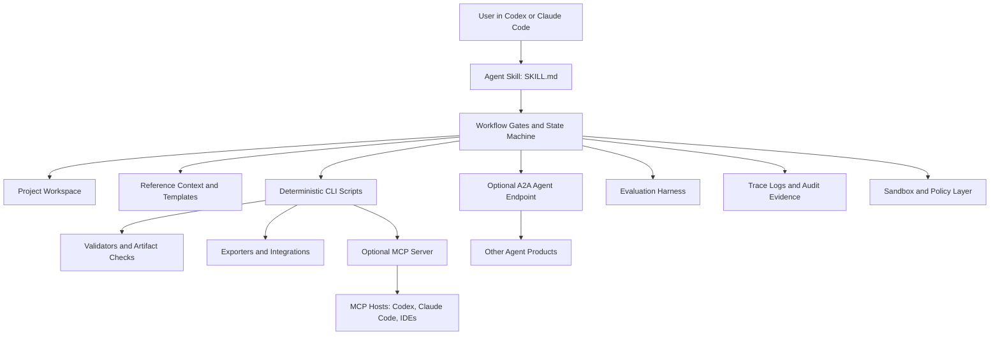

# Architecture Synthesis

Date: 2026-06-20

## Definition

An Agent Skill-compatible LLM execution harness is a packaged workflow runtime that lets a general coding agent reliably perform a specialized job.

It is not only:

- A prompt.
- An MCP server.
- A CLI.
- An agent framework.
- A benchmark harness.

It combines all of those only where useful. The key product is repeatable execution under Codex and Claude Code.

## Reference Pattern From `ppt-master`

`ppt-master` is the best local reference because its skill entrypoint defines:

- Activation metadata in `SKILL.md`.
- A strict serial pipeline.
- Blocking gates where the model must stop.
- Project initialization and source import.
- Deterministic scripts for conversion, image generation, quality checks, post-processing, and export.
- Templates, references, icon libraries, and standalone workflows.
- Live preview and quality validation.
- Compatibility boundaries against generic coding workflows.

The transferable lesson is this:

The skill file should describe the workflow contract, while scripts perform the deterministic work.

## Target Architecture



## Layers

### 1. Skill Layer

The skill is the shared compatibility surface. It should include:

- `SKILL.md` with activation rules, gates, stop points, and commands.
- `references/` for long policies, schemas, domain rules, examples, and rubrics.
- `scripts/` for deterministic operations.
- `templates/` and `assets/` if the harness emits documents, code, UI, slides, or structured artifacts.
- `workflows/` for optional routes that should not pollute the main pipeline.

### 2. Project Workspace Layer

Every run should create a workspace with durable state:

```text
project/
  harness_state.json
  sources/
  notes/
  intermediate/
  outputs/
  evidence/
  logs/
```

The agent should never rely only on chat memory for long workflows. Store decisions, gates, artifact hashes, command outputs, and validation results.

### 3. Deterministic Execution Layer

Use scripts for operations that must be repeatable:

- Source import and normalization.
- Schema validation.
- File generation.
- Artifact export.
- Static checks.
- Browser or terminal smoke checks.
- Evaluation runs.
- Security scans.

The model should make decisions and write high-context artifacts. Scripts should do parsing, conversion, validation, and mechanical rewrites.

### 4. MCP Layer

MCP is best used for structured tool access, not for replacing the skill.

Good MCP candidates:

- `init_project`
- `import_sources`
- `read_state`
- `validate_artifacts`
- `run_eval`
- `export_package`
- `query_index`

Avoid exposing broad raw shell tools through MCP unless the host already controls sandboxing and approvals.

### 5. A2A Layer

A2A is for inter-agent interoperability. Add it only when the harness must collaborate with other opaque agents.

Good A2A candidates:

- Long-running task status.
- Artifact handoff.
- Agent capability discovery.
- External specialist delegation.

Do not use A2A as the first implementation surface. A2A is useful after the core skill and scripts have a stable task model.

### 6. Orchestration Layer

Use orchestration frameworks only when the workflow needs durable, multi-step state that is not natural to a single skill run.

Recommended split:

- Skill-first: for Codex and Claude Code native use.
- LangGraph: for durable graph execution, checkpoints, resume, interrupts, and replay.
- OpenAI Agents SDK or Claude Agent SDK: for application-owned orchestration, tracing, guardrails, tool routing, and human approval flows.

### 7. Evaluation Layer

Treat evaluation as a first-class package directory, not an afterthought:

```text
evals/
  terminal-bench-style/
  fixture-projects/
  expected-artifacts/
  rubrics/
  golden-logs/
```

Good pass/fail criteria:

- Correct project structure.
- State file is valid.
- Required gates are honored.
- Generated artifact passes schema or visual checks.
- No secrets are written to output.
- Tool calls stay within allowlisted commands.
- Recovery works after interruption.

## Codex Compatibility Checklist

- Ship `AGENTS.md` with repo-level guidance.
- Ship `skills/<name>/SKILL.md` and keep it compact enough for progressive disclosure.
- Put deep instructions under `references/`.
- Use deterministic shell commands that work in macOS/Linux.
- Document sandbox and approval assumptions.
- If shipping MCP, document Codex `config.toml` configuration separately.
- Avoid assuming a clean git worktree.

## Claude Code Compatibility Checklist

- Keep `SKILL.md` portable and invocation-friendly.
- If using hooks, make them optional and documented.
- If using MCP, respect Claude Code output limits and environment behavior.
- Avoid hidden reliance on Codex-only tools.
- Document how to install through `npx skills add ... --agent claude-code`.
- Provide fallback CLI commands when MCP is unavailable.

## Naming

Use these terms precisely:

- Agent Skill: the portable instruction/resource package.
- Plugin: installable bundle that can include skills, apps, MCP config, and assets.
- Harness: the full execution system around an LLM: workflow, scripts, tools, state, evals, and security.
- MCP server: structured tool/context server.
- A2A agent: interoperable remote or local agent endpoint.
- Runtime: the sandboxed process/container where commands and tools run.

## 2026-06-20 Image Harness Architecture Lock

For the image-generation harness, the architecture decision is:

```text
Agent Skill first
  -> deterministic CLI/scripts
  -> creator intent graph
  -> ComfyUI capability index
  -> workflow compiler and validator
  -> ComfyUI local/cloud execution
  -> visual evaluation and provenance export
  -> optional MCP server
  -> optional A2A endpoint
```

This avoids two failure modes:

- A thin prompt wrapper that cannot handle LoRA, ControlNet, SAM, SAG, custom nodes, evaluation, or provenance.
- A brittle attempt to port/rewrite ComfyUI instead of driving it as the graph runtime it already is.

The first production-quality implementation should support template filling and approved subgraph composition only. Arbitrary graph synthesis, custom-node installation, and autonomous pipeline search should come later after schema validation, sandboxing, and evaluation are strong.
