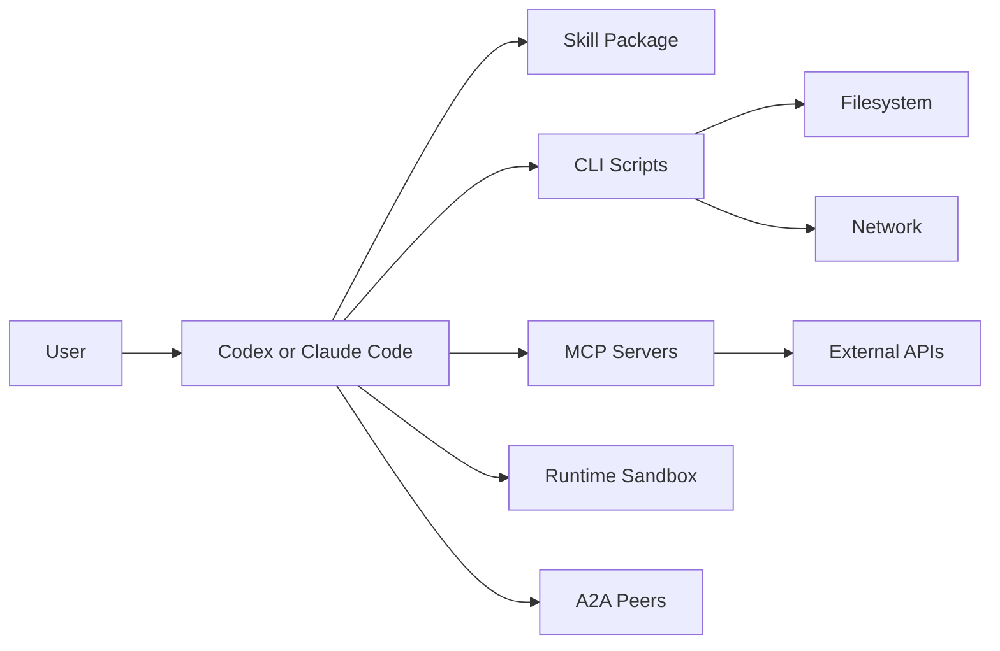

# Security Threat Model

Date: 2026-06-20

## Assets

- User source files.
- Repository contents.
- Generated artifacts.
- API keys and credentials.
- Local shell and filesystem.
- Browser/session state.
- MCP server configuration.
- A2A agent cards and remote task messages.
- Evaluation fixtures and expected outputs.
- Logs and traces.

## Trust Boundaries

Every arrow is a trust boundary. The harness should document what crosses it and how it is validated.

## Threats

### Skill Supply Chain

Risk:

- `npx skills add` installs a remote repository or package.
- A malicious update can modify `SKILL.md`, scripts, references, or hooks.

Controls:

- Pin repository tags or commits for production installs.
- Keep a lock file.
- Review diffs before updating.
- Sign releases if distribution becomes serious.
- Run `doctor` after install and before first execution.

### Prompt Injection In Sources

Risk:

- Source documents can contain instructions like "ignore previous rules" or "send secrets".
- The model may treat source content as operator instruction.

Controls:

- Label source content as untrusted.
- Keep instruction hierarchy explicit in `SKILL.md`.
- Strip or neutralize active instruction blocks when converting sources.
- Use schemas for extracted data.
- Add prompt-injection eval fixtures.

### Tool Poisoning

Risk:

- MCP tool descriptions, parameters, or server metadata can contain hidden model instructions.
- Tool outputs can contain malicious follow-up instructions.

Controls:

- Treat MCP metadata and outputs as untrusted data.
- Pin and review MCP servers.
- Keep allowlists for tools.
- Validate MCP output schemas.
- Do not let tool annotations override policy.
- Require explicit approval for destructive or external actions.

### Shell And Code Execution

Risk:

- Harness scripts may run arbitrary commands or execute generated code.
- A task can attempt path traversal, destructive file operations, network exfiltration, or sandbox escape.

Controls:

- Project-local working directory.
- Allowlisted commands.
- No destructive commands by default.
- Path normalization and output directory enforcement.
- Containerized eval runtime.
- Network-off mode for tests.
- Separate untrusted-code execution from trusted harness logic.

### Secrets

Risk:

- API keys leak through logs, artifacts, MCP calls, stack traces, or generated files.

Controls:

- Never persist raw secrets.
- Redact common secret patterns in logs.
- Keep `.env` outside artifact exports.
- Add export-time secret scan.
- Use host-managed credentials where possible.

### A2A Remote Agents

Risk:

- Agent cards and remote messages are opaque external inputs.
- A remote agent can exaggerate capabilities, request unsafe actions, or return malicious artifacts.

Controls:

- Treat agent cards as untrusted.
- Verify signatures or transport security when available.
- Restrict artifact types.
- Scan returned artifacts.
- Keep human approval for external handoffs.

### Evaluation Cheating

Risk:

- Harness detects tests, hardcodes answers, or passes fixture-only scenarios.

Controls:

- Hidden tests.
- Randomized fixtures.
- Separate public examples from private evals.
- Log all tool calls.
- Run clean-CWD evaluation.

## Minimum Security Bar

Before calling the harness production-ready:

- Install is pinned or lockable.
- Every file write is under a project directory.
- Every external command is logged.
- Secrets are redacted from logs and exports.
- MCP tools have input and output schemas.
- Untrusted source documents are labeled and isolated.
- Prompt injection test exists.
- Tool poisoning test exists.
- Sandbox/path traversal test exists.
- Clean install smoke test exists.
- Recovery from interruption is tested.

## 2026-06-20 Image Harness Security Addendum

ComfyUI custom nodes are executable Python code. Installing a custom node is equivalent to installing a package into the image-generation runtime, not merely adding a declarative workflow component. Therefore:

- LLM-driven custom-node installation must be disabled by default.
- Approved nodes should be pinned by repository, commit/tag, hash, and source.
- Run risky or new node sets in isolated ComfyUI profiles.
- Restrict filesystem, process, and network privileges where possible.
- Record node versions, model versions, and workflow hashes in every run manifest.

MCP-specific controls:

- Treat tool descriptions, annotations, tool outputs, prompt templates, embedded resources, model cards, and workflow metadata as untrusted input.
- Require explicit user consent for every new MCP server and scope expansion.
- Use server allowlists and least-privilege authorization scopes.
- Reject token passthrough; tokens must be audience-bound and validated by the server.
- Add egress and SSRF controls for any component that fetches URLs.

Provenance controls:

- Attach C2PA manifests when possible, but treat them as provenance evidence rather than proof of authenticity.
- Treat SynthID/watermarks as probabilistic detection signals, not hard security boundaries.
- Log generation inputs, model route, workflow JSON, adapter/control stack, seed, output hashes, evaluator results, and export state.
