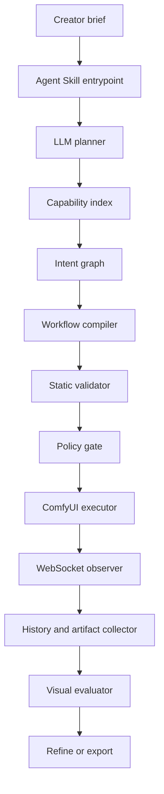

# ComfyUI Full-Control Analysis

Date: 2026-06-20

## Direct Answer

Yes. It is realistic to build an Agent Skill-compatible LLM execution harness that controls ComfyUI's full practical pipeline surface.

The correct architecture is not "migrate ComfyUI into the harness." The correct architecture is:

```text
Agent Skill / Codex / Claude Code
  -> LLM planner
  -> capability index
  -> typed control graph
  -> ComfyUI workflow compiler
  -> validator and policy gate
  -> ComfyUI Server API or Cloud API
  -> WebSocket observer
  -> output evaluator
  -> creator project state
```

ComfyUI remains the graph runtime, model loader, sampler host, and node ecosystem. The harness becomes the LLM-controlled operating layer above it.

## What "Full Control" Can Mean

Full control is feasible if defined as:

- discover available nodes and node input schemas
- discover installed model categories and model files
- import or compile API-format workflows
- upload source images and masks
- queue workflows
- observe progress, node execution, errors, and history
- fetch generated images and metadata
- interrupt, clear queue, and free memory
- reuse workflow templates and subgraph blueprints
- create documented custom nodes when the feature is missing
- expose curated workflows as Agent Skill commands or MCP tools

Full control is not feasible if defined as:

- guaranteeing every third-party custom node is safe, documented, and stable
- blindly installing arbitrary custom nodes from natural language
- bypassing model license or provider terms
- controlling hidden GUI-only behavior without API exposure
- making every model architecture accept every LoRA, ControlNet, or adapter
- letting the LLM invent node links without validation

## Official Control Surfaces

| Surface | Why it matters for an LLM harness |
|---|---|
| Workflow API format | ComfyUI workflows are JSON node graphs for programmatic submission. API format omits UI layout metadata and uses node IDs, `class_type`, and `inputs`. |
| `/prompt` POST | Validates and queues a workflow. Returns `prompt_id` and queue position, or errors and node errors. |
| `/ws` WebSocket | Emits execution progress, node execution status, errors, debug information, and queue updates. |
| `/history` and `/history/{prompt_id}` | Retrieves completed outputs and per-node results. |
| `/view` | Retrieves generated image files. |
| `/upload/image` and `/upload/mask` | Sends source images and masks into workflows. |
| `/object_info` and `/object_info/{node_class}` | Discovers all node types and a specific node schema. This is the foundation for typed LLM graph compilation. |
| `/models` and `/models/{folder}` | Discovers model categories and installed model files. |
| `/embeddings` | Discovers available textual inversion embeddings. |
| `/system_stats` | Gives hardware, Python, device, and VRAM context for route selection. |
| `/queue`, `/interrupt`, `/free` | Operational controls for scheduling, stopping, and memory cleanup. |
| `/workflow_templates` | Discovers workflow templates exposed by custom node modules. |
| `/global_subgraphs` | Discovers reusable subgraph blueprints from custom nodes. |
| V3 custom node schema | Gives a more organized node definition path with typed inputs, outputs, hidden inputs, async execution, progress reporting, and extension lifecycle. |
| Node docs and workflow templates | Custom nodes can ship Markdown docs, examples, and templates that the harness can index. |
| Comfy MCP tools | Official Comfy Cloud/Partner MCP and community local MCPs show the direction of agent control. |

## LLM Control Architecture



The key design decision is the `Intent graph` layer. It prevents the LLM from directly mutating brittle ComfyUI node IDs. The compiler owns node IDs, links, type checks, and resource estimates.

## Capability Index Design

At session start, the harness should build:

```json
{
  "server": {
    "base_url": "http://127.0.0.1:8188",
    "features": {},
    "system_stats": {}
  },
  "nodes": {
    "KSampler": {"inputs": {}, "outputs": []},
    "CheckpointLoaderSimple": {"inputs": {}, "outputs": []}
  },
  "models": {
    "checkpoints": [],
    "loras": [],
    "controlnet": [],
    "vae": [],
    "clip": [],
    "upscale_models": []
  },
  "templates": [],
  "subgraphs": [],
  "missing_capabilities": []
}
```

The LLM can read the index, but workflow compilation must validate against it.

## Control Levels

| Level | Description | Ship priority |
|---|---|---|
| L0: Template filling | Fill parameters in known workflows. | First |
| L1: Template composition | Combine approved subgraphs such as LoRA plus ControlNet plus upscale. | First |
| L2: Schema-guided graph editing | Add/remove nodes based on `object_info` and typed link rules. | Second |
| L3: Custom node authoring | Generate a custom ComfyUI node using V3 schema and tests. | Later |
| L4: Custom node installation | Install third-party custom nodes and models. | Later, allowlist only |
| L5: Autonomous pipeline search | Explore many graph variants under budget and eval gates. | Later |

This staged model is the difference between a dependable creator tool and a fragile agent demo.

## Existing ComfyUI-Agent Evidence

| Project | Finding |
|---|---|
| `Comfy-Org/ComfyUI` | Active core project. GitHub metadata captured 2026-06-20: 117,630 stars, GPL-3.0, pushed 2026-06-20. Description frames ComfyUI as a modular diffusion GUI, API, and backend with graph/nodes interface. |
| ComfyUI official docs | Document local and cloud APIs, workflow API format, server routes, custom nodes, V3 schema, workflow templates, subgraphs, and MCP agent tools. |
| Comfy Cloud MCP | Official hosted MCP direction for image, video, audio, and 3D generation through agents. Full workflow execution is cloud-focused and access was closed beta/waitlist at capture time. |
| Comfy Partner MCP | Official local MCP direction for partner providers through unified generation tools, not arbitrary custom local workflows. |
| `artokun/comfyui-mcp` | Community local/remote MCP and Claude Code plugin. GitHub README advertised 89 MCP tools, 22 AI skills, live graph editing, model/custom-node management, and auto-exposed workflows. Metadata captured 2026-06-20: MIT, 166 stars, pushed 2026-06-20. |
| `SaladTechnologies/comfyui-api` | API server for horizontally scaling ComfyUI. Metadata captured 2026-06-20: MIT, 431 stars, pushed 2026-06-19. Useful deployment reference. |

## Build Strategy

### Phase 1: Control without graph synthesis

- Require a running ComfyUI server.
- Index `object_info`, `models`, `system_stats`, templates, and subgraphs.
- Import a small library of known-good API-format workflows.
- Let the LLM fill typed slots only: prompt, seed, size, model, LoRA, control image, mask, steps, CFG, denoise.
- Execute and evaluate outputs.

### Phase 2: Controlled graph composition

- Define approved subgraphs: LoRA, ControlNet depth, ControlNet pose, SAM mask, inpaint, IP-Adapter, upscale, OCR repair.
- Let the LLM select subgraphs from creator intent.
- Compiler assembles the ComfyUI workflow.
- Validator checks node existence, link compatibility, model files, image dimensions, and resource estimates.

### Phase 3: Schema-guided graph editing

- Use `object_info/{node_class}` to allow LLM-proposed graph changes.
- Translate proposed changes into patch operations:
  - add node
  - remove node
  - connect output to input
  - set input value
  - replace model
  - insert subgraph
- Reject patches that fail type checks or policy.

### Phase 4: Custom node path

- Author internal custom nodes only when a missing operation is stable and testable.
- Use V3 schema.
- Ship node docs, example workflows, and subgraph blueprints.
- Keep custom node installation allowlisted and audited.

## Risk Analysis

| Risk | Why it matters | Mitigation |
|---|---|---|
| Custom node supply chain | Third-party nodes can execute Python and access filesystem/network. | Allowlist, pin commits, verify hashes, use isolated ComfyUI profiles, avoid auto-install by LLM. |
| Model license drift | Some models are noncommercial or provider-bound. | Store license metadata and require route policy checks. |
| Graph hallucination | LLM may invent node names or invalid links. | Compile from capability index and validate against `object_info`. |
| Resource blowups | High resolution/video workflows can exhaust VRAM or disk. | Use `system_stats`, static estimates, queue budget, output quotas, and interrupt/free controls. |
| Prompt injection through metadata | Model cards, node docs, workflow names, and image metadata can contain malicious instructions. | Treat external docs as data, strip instructions, and separate policy from retrieved content. |
| Non-determinism | Same prompt may produce inconsistent results. | Preserve seed, workflow JSON, model hashes, node versions, and output metadata. |
| Evaluation weakness | Pretty images can fail creator intent. | Add OCR, color, mask, identity, composition, and human review gates. |

## Final Feasibility Rating

Feasibility: high for an LLM-controlled ComfyUI harness.

Recommended stance:

- Build around ComfyUI's API-format workflow graph.
- Keep ComfyUI as runtime.
- Build a capability index and compiler.
- Start with template/subgraph control.
- Add schema-guided graph editing after validation is strong.
- Use MCP as a tool transport, not the whole product.
- Use Agent Skill as the cross-Codex/Claude Code packaging surface.

## 2026-06-20 Verification Addendum

Fresh verification confirms the central thesis and tightens the boundary:

- Current ComfyUI master was pinned at `dc3f8f314a987d23115ed278693e76cf6e72a5a0` on 2026-06-20.
- ComfyUI exposes the practical control plane required by a harness: `/prompt`, `/ws`, `/object_info`, `/models`, `/history`, `/queue`, `/interrupt`, `/free`, upload/view routes, `/workflow_templates`, and subgraph discovery.
- `/object_info` exposes node declarations such as `INPUT_TYPES`, output types, names, descriptions, categories, and module metadata. This is enough for structural graph compilation and validation.
- It is not a universal semantic contract. Arbitrary custom-node behavior, side effects, external API calls, license requirements, and hidden state cannot be proven from metadata alone.
- ComfyUI issue #8899 and PR #13094 remain open as of this pass; both are about adding a formal JSON Schema for the `/prompt` API format. The harness should ship its own conservative schema and validate against live `/object_info` instead of depending on upstream schema availability.

Closest public ComfyUI agent-control attempts:

| Project | Finding | Gap |
|---|---|---|
| `artokun/comfyui-mcp` | Broadest public project found: Claude Code plugin + MCP server, live graph editing, workflow execution/authoring, model and custom-node management. Verified 166 stars and 2026-06-20 update. | Does not prove universal compatibility with every arbitrary custom-node workflow. |
| `LingyiChen-AI/comfyui-workflow-skill` | Natural-language to ready ComfyUI workflow JSON with templates and node definitions. Verified 312 stars and 2026-06-20 update. | Workflow generator, not a live runtime/control plane. |
| `MieMieeeee/comfyui-agent-skill` | Agent Skill-style local/self-hosted registered workflow executor returning structured JSON. | Registered workflows only. |
| `HuangYuChuh/ComfyUI_Skills_OpenClaw` | Turns ComfyUI workflows into callable skills for OpenClaw, Hermes, Codex, and Claude Code. | Skill/CLI wrapper, not arbitrary graph surgery. |
| Official Comfy Cloud/Partner MCP | Authoritative agent direction from ComfyUI docs. | Cloud MCP is scoped/beta; Partner MCP is private preview and provider-generation oriented. |

Conclusion: no maintained public project was found that fully owns complete workflow orchestration, arbitrary custom-node management, live graph editing, execution, cross-agent skill packaging, security policy, evaluation, and provenance as one universal harness. The available evidence supports building above ComfyUI, not migrating/replacing it.
